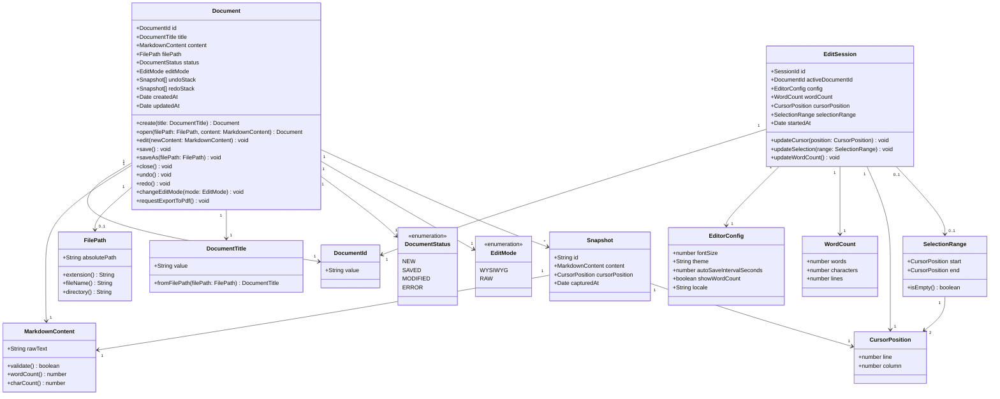

# Editor 도메인 모델
# ModuMark - 마크다운 편집 Bounded Context

| 항목 | 내용 |
|------|------|
| 문서 버전 | v1.0 |
| 작성일 | 2026-03-07 |
| 작성자 | DDD 아키텍트 |
| 상태 | 초안 (Draft) |

---

## 목차

1. [Bounded Context 정의](#1-bounded-context-정의)
2. [Ubiquitous Language](#2-ubiquitous-language)
3. [핵심 Aggregate](#3-핵심-aggregate)
4. [Domain Event 목록](#4-domain-event-목록)
5. [Repository 인터페이스](#5-repository-인터페이스)
6. [Mermaid 클래스 다이어그램](#6-mermaid-클래스-다이어그램)
7. [Context Map](#7-context-map)

---

## 1. Bounded Context 정의

### 컨텍스트 이름: Editor (마크다운 편집기)

**목적**: 사용자가 마크다운 파일을 WYSIWYG 방식으로 작성·편집·저장할 수 있는 핵심 편집 경험을 제공한다.

**경계 설명**:
- 마크다운 문서의 생성, 편집, 저장, 불러오기를 책임진다.
- 파일 시스템과의 연결(기본 앱 등록)은 Platform 컨텍스트에 위임한다.
- PDF 변환 요청은 PDF 컨텍스트에 위임한다.
- 광고 노출은 Monetization 컨텍스트에 위임한다.

**핵심 비즈니스 규칙**:
- 사용자 파일은 로컬 파일 시스템에만 저장되며, 서버로 전송되지 않는다.
- WYSIWYG 편집 중 마크다운 원문(raw)과 렌더링 뷰(preview)는 항상 동기화 상태를 유지한다.
- 문서는 항상 유효한 마크다운 형식이어야 한다.

---

## 2. Ubiquitous Language

| 한국어 용어 | 영어 용어 | 설명 |
|------------|----------|------|
| 문서 | Document | 마크다운 내용을 담는 최상위 편집 단위 |
| 마크다운 원문 | MarkdownContent | 마크다운 문법으로 작성된 원시 텍스트 |
| 렌더링 결과 | RenderedOutput | 마크다운 원문을 HTML/화면으로 변환한 결과 |
| WYSIWYG 편집 | WysiwygEditing | 렌더링 결과를 직접 편집하는 방식 |
| 파일 경로 | FilePath | 로컬 파일 시스템에서 문서 파일의 위치 |
| 문서 제목 | DocumentTitle | 문서를 식별하는 이름 (파일명 기반) |
| 편집 세션 | EditSession | 사용자가 문서를 열어 작업하는 단위 시간 |
| 저장 | Save | 현재 편집 내용을 로컬 파일에 기록하는 행위 |
| 자동 저장 | AutoSave | 일정 간격 또는 변경 감지 시 자동으로 저장하는 기능 |
| 스냅샷 | Snapshot | 특정 시점의 문서 상태를 기록한 것 (실행 취소용) |
| 커서 위치 | CursorPosition | 편집 중 커서가 위치한 문서 내 좌표 |
| 선택 영역 | SelectionRange | 편집 중 사용자가 선택한 텍스트 범위 |
| 헤딩 | Heading | 마크다운의 제목 요소 (H1~H6) |
| 코드 블록 | CodeBlock | 마크다운에서 코드를 표현하는 블록 요소 |
| 미리보기 | Preview | 편집 중 렌더링 결과를 보여주는 뷰 |
| 편집 모드 | EditMode | 현재 에디터가 작동하는 방식 (WYSIWYG / Raw) |
| 탭 | Tab | 에디터에서 문서 하나를 표시하는 탭 단위 |
| 탭 목록 | TabList | 현재 열린 탭들의 순서 있는 컬렉션 |
| 활성 탭 | ActiveTab | 현재 포커스된 탭 |
| 탭 상태 | TabState | 탭의 저장 상태 표시 (저장됨 / 미저장 변경사항 있음) |

---

## 3. 핵심 Aggregate

### 3.1 Document Aggregate (문서)

**Aggregate Root**: `Document`

**책임**: 마크다운 문서의 전체 생명 주기를 관리한다. 문서 생성부터 저장, 수정, 닫기까지 모든 상태 전이를 담당한다.

#### Entity

| 엔티티 | 역할 | 식별자 |
|--------|------|--------|
| `Document` | Aggregate Root. 문서의 상태와 내용을 관리 | `DocumentId` (UUID) |
| `EditSession` | 문서 편집 세션. 열기부터 닫기까지의 단위 | `SessionId` (UUID) |

#### Value Object

| Value Object | 역할 | 불변성 이유 |
|-------------|------|------------|
| `DocumentId` | 문서 고유 식별자 | 생성 후 변경 불가 |
| `MarkdownContent` | 마크다운 원문 텍스트 | 내용 변경 시 새 객체 생성 |
| `FilePath` | 로컬 파일 시스템 경로 | 경로는 값으로 비교 |
| `DocumentTitle` | 문서 제목 (파일명 파생) | 파일명 기반으로 결정 |
| `Snapshot` | 특정 시점 문서 상태 | 이력 저장용, 수정 불가 |
| `CursorPosition` | 커서의 줄·열 좌표 | 위치 값으로 비교 |
| `SelectionRange` | 선택 영역의 시작/끝 좌표 | 범위 값으로 비교 |
| `EditMode` | 편집 모드 (WYSIWYG / RAW) | 열거형 값 |
| `DocumentStatus` | 문서 상태 (새문서 / 저장됨 / 수정됨 / 오류) | 열거형 값 |

#### Document Aggregate 비즈니스 규칙

1. 문서는 `NEW`, `SAVED`, `MODIFIED`, `ERROR` 상태를 가진다.
2. `MODIFIED` 상태의 문서를 닫으려 할 때 사용자에게 저장 여부를 묻는다.
3. 자동 저장은 마지막 수정 후 30초 이내에 실행된다.
4. 실행 취소(Undo) 스택은 최대 100개의 Snapshot을 유지한다.
5. `FilePath`가 없는 문서는 저장 시 파일 경로 지정을 요구한다.

---

### 3.2 TabManager Aggregate (탭 관리자)

**Aggregate Root**: `TabManager`

**책임**: 현재 열린 탭 목록, 활성 탭, 탭 순서를 관리한다. 새 문서/파일 열기가 탭으로 처리되도록 조율한다.

#### Entity

| 엔티티 | 역할 | 식별자 |
|--------|------|--------|
| `TabManager` | Aggregate Root. 탭 목록 전체 상태 관리 | 싱글톤 |
| `Tab` | 탭 하나. 연결된 Document와 표시 상태를 관리 | `TabId` (UUID) |

#### Value Object

| Value Object | 역할 |
|-------------|------|
| `TabId` | 탭 고유 식별자 |
| `TabOrder` | 탭 순서 (드래그 앤 드롭 재정렬 지원) |
| `TabDisplayName` | 탭에 표시되는 이름 (파일명 기반, 미저장 표시 포함) |

#### TabManager 비즈니스 규칙

1. 새 문서 생성 또는 파일 열기는 항상 새 탭으로 처리된다. 새 창을 열지 않는다.
2. 이미 열린 파일 경로를 다시 열기 시도하면 기존 탭으로 포커스가 이동한다.
3. 미저장 변경사항이 있는 탭 이름에는 수정 표시(`●`)를 붙인다.
4. 마지막 탭을 닫으면 빈 새 탭(제목 없음)이 자동으로 생성된다.
5. 탭은 드래그 앤 드롭으로 순서를 변경할 수 있다.
6. Ctrl+T로 새 탭, Ctrl+W로 현재 탭 닫기, Ctrl+Tab으로 다음 탭 전환을 지원한다.

---

### 3.3 EditorSession Aggregate (편집 세션)

**Aggregate Root**: `EditorSession`

**책임**: 현재 에디터 인스턴스의 상태(열린 문서, 편집 모드, UI 설정)를 관리한다.

#### Entity

| 엔티티 | 역할 | 식별자 |
|--------|------|--------|
| `EditorSession` | Aggregate Root. 에디터 전체 상태 관리 | `SessionId` (UUID) |

#### Value Object

| Value Object | 역할 |
|-------------|------|
| `SessionId` | 세션 고유 식별자 |
| `EditorConfig` | 에디터 설정 (폰트 크기, 테마, 자동 저장 간격 등) |
| `WordCount` | 단어 수 / 글자 수 통계 |

---

## 4. Domain Event 목록

| 이벤트 이름 | 발생 시점 | 포함 데이터 | 구독 컨텍스트 |
|------------|----------|------------|--------------|
| `TabOpened` | 새 탭이 생성될 때 | `tabId`, `documentId`, `openedAt` | - |
| `TabClosed` | 탭이 닫힐 때 | `tabId`, `documentId`, `closedAt` | - |
| `TabActivated` | 활성 탭이 전환될 때 | `tabId`, `documentId`, `activatedAt` | - |
| `TabReordered` | 탭 순서가 변경될 때 | `tabId`, `fromIndex`, `toIndex` | - |
| `DocumentCreated` | 새 문서가 생성될 때 | `documentId`, `createdAt` | Platform |
| `DocumentOpened` | 기존 파일을 열었을 때 | `documentId`, `filePath`, `openedAt` | Platform, Monetization |
| `DocumentEdited` | 문서 내용이 변경될 때 | `documentId`, `changeType`, `editedAt` | - |
| `DocumentSaved` | 문서가 저장될 때 | `documentId`, `filePath`, `savedAt` | Platform |
| `DocumentSavedAs` | 다른 이름으로 저장될 때 | `documentId`, `oldPath`, `newPath`, `savedAt` | Platform |
| `DocumentClosed` | 문서를 닫을 때 | `documentId`, `closedAt` | Monetization |
| `AutoSaveTriggered` | 자동 저장이 실행될 때 | `documentId`, `savedAt` | - |
| `ExportToPdfRequested` | PDF 변환 버튼 클릭 시 | `documentId`, `markdownContent`, `requestedAt` | PDF |
| `UndoPerformed` | 실행 취소 실행 시 | `documentId`, `snapshotId` | - |
| `RedoPerformed` | 다시 실행 실행 시 | `documentId`, `snapshotId` | - |
| `EditModeChanged` | 편집 모드 전환 시 | `documentId`, `fromMode`, `toMode` | - |

---

## 5. Repository 인터페이스

```typescript
// 문서 저장소 인터페이스
interface DocumentRepository {
  // 문서 ID로 메모리 내 문서 조회
  findById(id: DocumentId): Promise<Document | null>;

  // 파일 경로로 문서 조회
  findByFilePath(filePath: FilePath): Promise<Document | null>;

  // 현재 열린 모든 문서 목록 조회
  findAllOpened(): Promise<Document[]>;

  // 문서를 로컬 파일에 저장
  save(document: Document): Promise<void>;

  // 문서를 지정한 경로에 저장 (다른 이름으로 저장)
  saveAs(document: Document, filePath: FilePath): Promise<void>;

  // 메모리에서 문서 제거 (닫기)
  remove(id: DocumentId): Promise<void>;
}

// 파일 시스템 저장소 인터페이스 (Platform 컨텍스트와 통신)
interface FileSystemRepository {
  // 파일 경로에서 마크다운 원문을 읽어옴
  readMarkdownFile(filePath: FilePath): Promise<MarkdownContent>;

  // 마크다운 원문을 파일 경로에 기록
  writeMarkdownFile(filePath: FilePath, content: MarkdownContent): Promise<void>;

  // 파일 존재 여부 확인
  fileExists(filePath: FilePath): Promise<boolean>;

  // 최근 파일 목록 조회
  getRecentFiles(): Promise<FilePath[]>;

  // 최근 파일 목록에 추가
  addToRecentFiles(filePath: FilePath): Promise<void>;
}

// 에디터 설정 저장소 인터페이스
interface EditorConfigRepository {
  // 현재 에디터 설정 조회
  getConfig(): Promise<EditorConfig>;

  // 에디터 설정 저장
  saveConfig(config: EditorConfig): Promise<void>;
}
```

---

## 6. Mermaid 클래스 다이어그램



---

## 7. Context Map

### 다른 Bounded Context와의 관계

```
[Editor BC]
    │
    ├──── PDF BC (Customer / Supplier)
    │       관계: Editor가 Customer, PDF가 Supplier
    │       통신: ExportToPdfRequested 도메인 이벤트 발행
    │       내용: 마크다운 원문을 PDF BC에 전달하여 PDF 변환 요청
    │
    ├──── Platform BC (Partnership)
    │       관계: 대등한 파트너십
    │       통신: DocumentOpened / DocumentSaved 이벤트 공유
    │       내용: 파일 시스템 읽기/쓰기, 최근 파일 목록, 파일 연결(기본 앱)
    │
    └──── Monetization BC (Customer / Supplier)
            관계: Monetization이 Supplier (광고 노출 서비스 제공)
            통신: DocumentOpened / DocumentClosed 이벤트 수신
            내용: 편집 세션 시작/종료 시 광고 노출 타이밍 결정
```

| 관계 방향 | 상대 컨텍스트 | 관계 패턴 | 통신 방식 | 설명 |
|----------|-------------|---------|----------|------|
| Editor → PDF | PDF | Customer/Supplier | 도메인 이벤트 (비동기) | PDF 변환 요청 전달 |
| Editor ↔ Platform | Platform | Partnership | 도메인 이벤트 + 공유 커널 | 파일 시스템 연동 |
| Editor → Monetization | Monetization | Conformist | 도메인 이벤트 (비동기) | 세션 생명 주기 알림 |

---

*본 문서는 ModuMark Editor Bounded Context의 도메인 모델을 정의합니다. 기술 구현 상세는 PRD 및 개발 문서를 참조하세요.*
