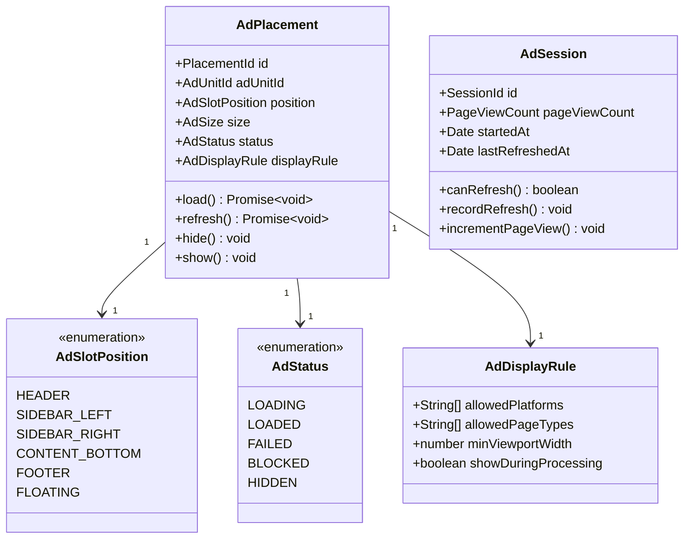

# Monetization 도메인 모델
# ModuMark - 수익화 Bounded Context

| 항목 | 내용 |
|------|------|
| 문서 버전 | v2.0 |
| 작성일 | 2026-03-07 |
| 수정일 | 2026-03-08 |
| 작성자 | DDD 아키텍트 |
| 상태 | Active (Phase 1 완료) |

---

## 목차

1. [Bounded Context 정의](#1-bounded-context-정의)
2. [Ubiquitous Language](#2-ubiquitous-language)
3. [핵심 Aggregate](#3-핵심-aggregate)
4. [Domain Event 목록](#4-domain-event-목록)
5. [Repository 인터페이스](#5-repository-인터페이스)
6. [Mermaid 클래스 다이어그램](#6-mermaid-클래스-다이어그램)
7. [Context Map](#7-context-map)

---

## 1. Bounded Context 정의

### 컨텍스트 이름: Monetization (수익화)

**목적**: Google AdSense 광고 통합, 광고 노출 타이밍 관리, 광고 정책 준수를 담당한다. 서비스 무료 운영의 수익 기반을 제공한다.

**경계 설명**:
- Google AdSense 스크립트 로딩 및 광고 슬롯 관리를 책임진다.
- 다른 도메인의 이벤트를 수신하여 최적 광고 노출 타이밍을 결정한다.
- 광고 차단기(Ad Blocker) 감지 및 대응 로직을 포함한다.
- 광고 수익 지표 추적은 AdSense 대시보드에 위임한다.
- 핵심 기능(편집, PDF 처리)에 광고가 방해되지 않도록 노출 위치와 타이밍을 제어한다.

**핵심 비즈니스 규칙**:
- 성인 광고 및 부적절한 광고 카테고리는 AdSense 정책 설정으로 차단한다.
- 광고는 편집 영역에 오버레이되지 않는다.
- 광고 로딩 실패 시 레이아웃 깨짐이 발생하지 않는다 (광고 슬롯 공간 유지 또는 제거).
- 웹 버전에서만 광고가 노출된다. 데스크탑 앱(Tauri)에서는 광고가 노출되지 않는다.

---

## 2. Ubiquitous Language

| 한국어 용어 | 영어 용어 | 설명 |
|------------|----------|------|
| 광고 슬롯 | AdSlot | 광고가 표시될 페이지 내 지정 위치 |
| 광고 단위 | AdUnit | AdSense에서 생성된 개별 광고 단위 (ID 포함) |
| 광고 노출 | AdImpression | 광고가 사용자 화면에 표시된 이벤트 |
| 광고 클릭 | AdClick | 사용자가 광고를 클릭한 이벤트 |
| 광고 차단기 | AdBlocker | 광고 표시를 차단하는 브라우저 확장 도구 |
| 광고 정책 | AdPolicy | Google AdSense 허용/차단 광고 카테고리 규칙 |
| 광고 새로고침 | AdRefresh | 특정 이벤트 발생 시 새 광고로 교체하는 행위 |
| 노출 제한 | FrequencyCap | 동일 사용자에게 같은 광고가 너무 자주 노출되지 않도록 제한 |
| 뷰어빌리티 | Viewability | 광고가 실제 화면에 표시된 비율 (IAB 기준 50% 이상 1초) |
| 페이지뷰 | PageView | 사용자가 페이지를 방문한 이벤트 |
| 세션 | Session | 연속된 사용자 활동 단위 |

---

## 3. 핵심 Aggregate

### 3.1 AdPlacement Aggregate (광고 배치)

**Aggregate Root**: `AdPlacement`

**책임**: 페이지 내 광고 슬롯의 구성, 상태, 노출 이력을 관리한다.

#### Entity

| 엔티티 | 역할 | 식별자 |
|--------|------|--------|
| `AdPlacement` | Aggregate Root. 광고 배치 설정과 상태 관리 | `PlacementId` |

#### Value Object

| Value Object | 역할 |
|-------------|------|
| `PlacementId` | 광고 배치 고유 식별자 |
| `AdUnitId` | AdSense 광고 단위 ID |
| `AdSlotPosition` | 광고 위치 (HEADER / SIDEBAR / CONTENT_BOTTOM / FOOTER / FLOATING) |
| `AdSize` | 광고 크기 (responsive / 728x90 / 300x250 등) |
| `AdStatus` | 광고 상태 (LOADING / LOADED / FAILED / BLOCKED) |
| `AdDisplayRule` | 광고 노출 조건 (플랫폼, 페이지 타입, 세션 상태) |

#### 비즈니스 규칙

1. 에디터 활성 화면에서는 사이드바 광고만 허용한다 (편집 영역 방해 금지).
2. PDF 작업 진행 중(처리 중 상태)에는 광고 갱신을 일시 중단한다.
3. 모바일 화면(375px 미만)에서는 광고 슬롯을 숨겨 UX를 보호한다.
4. 광고 로딩 실패 시 해당 슬롯 공간은 자동으로 제거된다.

---

### 3.2 AdSession Aggregate (광고 세션)

**Aggregate Root**: `AdSession`

**책임**: 사용자 세션 내 광고 노출 이력을 추적하고 노출 빈도를 관리한다.

#### Value Object

| Value Object | 역할 |
|-------------|------|
| `SessionId` | 광고 세션 식별자 |
| `PageViewCount` | 세션 내 페이지뷰 카운트 |
| `AdRefreshTrigger` | 광고 갱신 트리거 조건 (문서 열기, PDF 변환 완료 등) |

#### 비즈니스 규칙

1. 광고 갱신은 사용자 의미 있는 행동(문서 열기, PDF 변환 완료) 후에만 수행한다.
2. 동일 세션에서 광고 갱신 횟수는 분당 최대 2회로 제한한다 (AdSense 정책 준수).

---

## 4. Domain Event 목록

| 이벤트 이름 | 발생 시점 | 수신 이벤트 출처 | 처리 내용 |
|------------|----------|----------------|----------|
| `AdInitialized` | AdSense 스크립트 로딩 완료 시 | - (내부 발생) | 광고 슬롯 활성화 |
| `AdLoaded` | 광고 슬롯에 광고가 채워질 때 | - (내부 발생) | 광고 노출 카운트 증가 |
| `AdFailed` | 광고 로딩 실패 시 | - (내부 발생) | 슬롯 제거, 레이아웃 조정 |
| `AdBlockerDetected` | 광고 차단기 감지 시 | - (내부 발생) | 차단기 안내 메시지 표시 |
| `AdRefreshTriggered` | 광고 갱신 조건 발생 시 | Editor, PDF, Platform | 광고 슬롯 갱신 |

**수신하는 외부 도메인 이벤트:**

| 수신 이벤트 | 출처 도메인 | 처리 내용 |
|------------|-----------|----------|
| `DocumentOpened` | Editor | 광고 갱신 트리거 |
| `DocumentClosed` | Editor | 세션 종료 체크 |
| `MarkdownToPdfCompleted` | PDF | 광고 갱신 트리거 |
| `MergeJobCompleted` | PDF | 광고 갱신 트리거 |
| `OcrJobCompleted` | PDF | 광고 갱신 트리거 |
| `AppStarted` | Platform | AdSense 초기화 트리거 |

---

## 5. Repository 인터페이스

```typescript
// 광고 배치 저장소 인터페이스
interface AdPlacementRepository {
  // 페이지 타입별 광고 배치 조건 조회
  findByPageType(pageType: string): Promise<AdPlacement[]>

  // 플랫폼(웹/앱)별 광고 배치 조건 조회
  findByPlatform(platform: RuntimeEnvironment): Promise<AdPlacement[]>
}

// 광고 서비스 인터페이스
interface AdService {
  // AdSense 스크립트 초기화
  initialize(clientId: string): Promise<void>

  // 특정 슬롯 광고 로딩
  loadAd(slotId: string, adUnitId: AdUnitId): Promise<AdStatus>

  // 특정 슬롯 광고 갱신
  refreshAd(slotId: string): Promise<void>

  // 광고 차단기 감지
  detectAdBlocker(): Promise<boolean>

  // 광고 서비스 활성화 여부 확인 (웹 환경인지)
  isAdEnabled(): boolean
}
```

---

## 6. Mermaid 클래스 다이어그램



---

## 7. Context Map

### 다른 Bounded Context와의 관계

```
[Monetization BC]
    │
    ├──── Editor BC (Conformist)
    │       관계: Monetization이 Editor를 따름 (수동적 이벤트 수신)
    │       통신: DocumentOpened / DocumentClosed 이벤트 수신
    │       내용: 문서 편집 세션 이벤트를 광고 갱신 트리거로 활용
    │
    ├──── PDF BC (Conformist)
    │       관계: Monetization이 PDF BC를 따름
    │       통신: MarkdownToPdfCompleted / MergeJobCompleted / OcrJobCompleted 수신
    │       내용: PDF 작업 완료 시 광고 갱신
    │
    └──── Platform BC (Conformist)
            관계: Monetization이 Platform을 따름
            통신: AppStarted 이벤트 수신
            내용: 앱 시작 시 AdSense 초기화
```

| 관계 방향 | 상대 컨텍스트 | 관계 패턴 | 통신 방식 | 설명 |
|----------|-------------|---------|----------|------|
| Monetization ← Editor | Editor | Conformist | 도메인 이벤트 구독 (비동기) | 문서 세션 이벤트 수신 |
| Monetization ← PDF | PDF | Conformist | 도메인 이벤트 구독 (비동기) | 작업 완료 이벤트 수신 |
| Monetization ← Platform | Platform | Conformist | 도메인 이벤트 구독 (비동기) | 앱 시작 이벤트 수신 |

---

*본 문서는 ModuMark Monetization Bounded Context의 도메인 모델을 정의합니다. Google AdSense 정책 준수 및 광고 배치 전략은 PRD를 참조하세요.*

---

## 문서 이력

| 버전 | 날짜 | 변경 내용 | 작성자 |
|------|------|----------|--------|
| v1.0 | 2026-03-07 | 초안 작성 | DDD 아키텍트 |
| v2.0 | 2026-03-08 | Phase 1 완료 반영: 수정일 추가, 상태 Active로 변경, FloatingAdSlot 반영 (AdSlotPosition에 FLOATING 추가) | 프로젝트 오너 |
