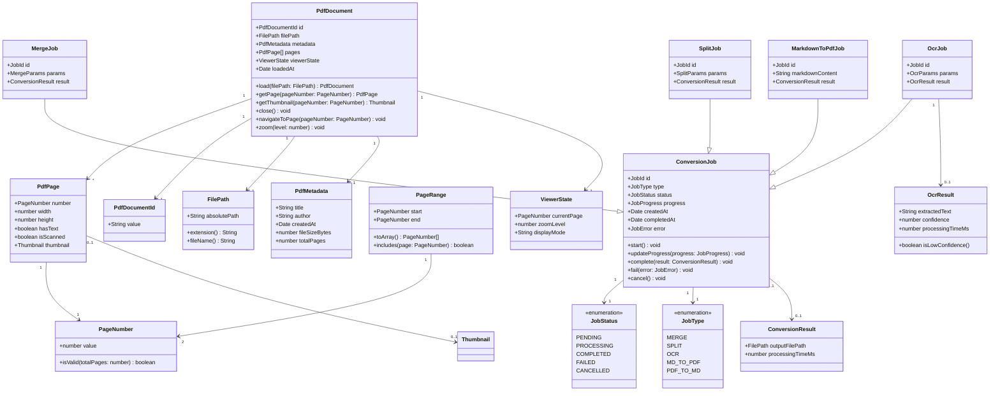

# PDF 도메인 모델
# ModuMark - PDF 처리 Bounded Context

| 항목 | 내용 |
|------|------|
| 문서 버전 | v1.0 |
| 작성일 | 2026-03-07 |
| 작성자 | DDD 아키텍트 |
| 상태 | 초안 (Draft) |

---

## 목차

1. [Bounded Context 정의](#1-bounded-context-정의)
2. [Ubiquitous Language](#2-ubiquitous-language)
3. [핵심 Aggregate](#3-핵심-aggregate)
4. [Domain Event 목록](#4-domain-event-목록)
5. [Repository 인터페이스](#5-repository-인터페이스)
6. [Mermaid 클래스 다이어그램](#6-mermaid-클래스-다이어그램)
7. [Context Map](#7-context-map)

---

## 1. Bounded Context 정의

### 컨텍스트 이름: PDF (PDF 처리기)

**목적**: PDF 파일의 뷰어 렌더링, 병합, 분할, OCR 텍스트 추출, 마크다운↔PDF 상호 변환을 담당한다.

**경계 설명**:
- PDF 파일 자체의 처리(읽기, 쓰기, 변환)를 책임진다.
- PDF 파일의 실제 I/O(디스크 접근)는 Platform 컨텍스트에 위임한다.
- OCR 처리는 이 컨텍스트 내에서 Tesseract.js를 통해 수행한다.
- 마크다운 원문을 받아 PDF로 변환하거나 PDF에서 마크다운으로 변환한다.
- 광고 노출 타이밍은 Monetization 컨텍스트에 알린다.

**핵심 비즈니스 규칙**:
- 처리되는 PDF 파일은 서버에 저장되지 않는다 (로컬 우선 원칙).
- 서버리스 처리 시 파일 크기 제한은 5MB 이하로 제한한다.
- OCR 처리는 가능한 한 클라이언트 사이드(Tesseract.js)에서 수행한다.
- 병합 대상 PDF는 최대 20개 파일, 총 합산 100MB 이하로 제한한다.
- PDF 변환 결과는 사용자의 로컬 파일 시스템에만 저장한다.

---

## 2. Ubiquitous Language

| 한국어 용어 | 영어 용어 | 설명 |
|------------|----------|------|
| PDF 문서 | PdfDocument | PDF 형식의 파일 단위 |
| PDF 페이지 | PdfPage | PDF 문서를 구성하는 개별 페이지 |
| 페이지 번호 | PageNumber | 문서 내 페이지의 순서 (1-based) |
| 병합 | Merge | 여러 PDF를 하나로 합치는 작업 |
| 분할 | Split | 하나의 PDF에서 특정 페이지(들)를 추출하는 작업 |
| 페이지 추출 | PageExtraction | 분할의 구체적 작업. 지정 페이지를 새 PDF로 만들기 |
| OCR | OcrExtraction | 이미지/스캔된 PDF에서 텍스트를 광학 인식하는 작업 |
| OCR 결과 | OcrResult | OCR 처리 후 추출된 텍스트와 신뢰도 정보 |
| 마크다운 변환 | MarkdownConversion | PDF 내용을 마크다운 형식으로 변환하는 작업 |
| PDF 변환 | PdfConversion | 마크다운 원문을 PDF 파일로 변환하는 작업 |
| 뷰어 | PdfViewer | PDF 파일을 화면에 렌더링하여 보여주는 기능 |
| 변환 작업 | ConversionJob | 하나의 변환/처리 요청 단위 |
| 작업 상태 | JobStatus | 변환 작업의 진행 상태 |
| 페이지 범위 | PageRange | 처리 대상 페이지의 시작~끝 범위 |
| 썸네일 | Thumbnail | PDF 페이지의 소형 미리보기 이미지 |
| OCR 신뢰도 | OcrConfidence | OCR 인식 결과의 정확도 점수 (0~100%) |

---

## 3. 핵심 Aggregate

### 3.1 PdfDocument Aggregate (PDF 문서)

**Aggregate Root**: `PdfDocument`

**책임**: PDF 파일의 메타데이터, 페이지 구조, 뷰어 상태를 관리한다.

#### Entity

| 엔티티 | 역할 | 식별자 |
|--------|------|--------|
| `PdfDocument` | Aggregate Root. PDF 파일의 구조와 상태 관리 | `PdfDocumentId` (UUID) |
| `PdfPage` | PDF의 개별 페이지 | `PageNumber` (페이지 번호, 문서 내 고유) |

#### Value Object

| Value Object | 역할 | 불변성 이유 |
|-------------|------|------------|
| `PdfDocumentId` | PDF 문서 고유 식별자 | 생성 후 변경 불가 |
| `FilePath` | 로컬 파일 시스템 경로 | 경로는 값으로 비교 |
| `PageNumber` | 페이지 번호 (1-based 정수) | 값 객체로 비교 |
| `PageRange` | 페이지 범위 (시작~끝) | 범위 값으로 비교 |
| `PdfMetadata` | 제목, 작성자, 생성일, 파일 크기 등 | 파일에서 읽은 불변 정보 |
| `Thumbnail` | 페이지 썸네일 이미지 (Base64) | 렌더링 결과물 |
| `ViewerState` | 현재 뷰어 상태 (줌 레벨, 현재 페이지) | 뷰 상태 값 |

#### PdfDocument 비즈니스 규칙

1. PdfDocument는 반드시 유효한 PDF 바이너리에서 생성되어야 한다.
2. 페이지 번호는 1부터 시작하며 전체 페이지 수를 초과할 수 없다.
3. 썸네일은 지연 로딩(lazy loading)으로 필요 시점에 생성한다.

---

### 3.2 ConversionJob Aggregate (변환 작업)

**Aggregate Root**: `ConversionJob`

**책임**: PDF 처리 작업(병합, 분할, OCR, 변환) 하나의 실행 단위를 관리한다. 작업의 생명 주기(대기 → 진행 → 완료/실패)를 추적한다.

#### Entity

| 엔티티 | 역할 | 식별자 |
|--------|------|--------|
| `ConversionJob` | Aggregate Root. 작업 상태 및 결과 관리 | `JobId` (UUID) |

#### Value Object

| Value Object | 역할 |
|-------------|------|
| `JobId` | 작업 고유 식별자 |
| `JobType` | 작업 유형 (MERGE / SPLIT / OCR / MD_TO_PDF / PDF_TO_MD) |
| `JobStatus` | 작업 상태 (PENDING / PROCESSING / COMPLETED / FAILED) |
| `JobProgress` | 작업 진행률 (0~100%) |
| `MergeParams` | 병합 작업 파라미터 (입력 파일 목록, 순서) |
| `SplitParams` | 분할 작업 파라미터 (대상 파일, 추출 페이지 범위) |
| `OcrParams` | OCR 작업 파라미터 (대상 파일, 언어 설정, 페이지 범위) |
| `OcrResult` | OCR 추출 결과 (텍스트, 신뢰도 점수, 처리 시간) |
| `ConversionResult` | 변환 완료 결과 (출력 파일 경로, 처리 시간) |
| `JobError` | 작업 실패 시 오류 정보 |

#### ConversionJob 비즈니스 규칙

1. 동일한 JobId는 재실행될 수 없다. 재시도 시 새로운 JobId를 발급한다.
2. `PROCESSING` 상태의 작업은 취소(CANCELLED) 전환이 가능하다.
3. OCR 결과의 신뢰도가 80% 미만일 경우 `LOW_CONFIDENCE` 경고를 포함한다.
4. 병합 대상 파일이 20개를 초과하거나 총 크기가 100MB를 초과하면 작업을 거부한다.
5. 서버리스 환경에서 처리 시 단일 파일 크기 제한은 5MB이다.

---

## 4. Domain Event 목록

| 이벤트 이름 | 발생 시점 | 포함 데이터 | 구독 컨텍스트 |
|------------|----------|------------|--------------|
| `PdfDocumentLoaded` | PDF 파일이 성공적으로 열렸을 때 | `pdfDocumentId`, `filePath`, `pageCount`, `loadedAt` | Monetization |
| `PdfDocumentClosed` | PDF 뷰어를 닫았을 때 | `pdfDocumentId`, `closedAt` | - |
| `MergeJobStarted` | PDF 병합 작업이 시작될 때 | `jobId`, `inputFiles`, `startedAt` | Monetization |
| `MergeJobCompleted` | PDF 병합 작업이 완료될 때 | `jobId`, `outputFilePath`, `completedAt` | Platform |
| `MergeJobFailed` | PDF 병합 작업이 실패할 때 | `jobId`, `error`, `failedAt` | - |
| `SplitJobStarted` | PDF 분할 작업이 시작될 때 | `jobId`, `sourceFile`, `pageRanges`, `startedAt` | Monetization |
| `SplitJobCompleted` | PDF 분할 작업이 완료될 때 | `jobId`, `outputFiles`, `completedAt` | Platform |
| `SplitJobFailed` | PDF 분할 작업이 실패할 때 | `jobId`, `error`, `failedAt` | - |
| `OcrJobStarted` | OCR 작업이 시작될 때 | `jobId`, `sourceFile`, `language`, `startedAt` | Monetization |
| `OcrJobCompleted` | OCR 작업이 완료될 때 | `jobId`, `ocrResult`, `completedAt` | Editor |
| `OcrJobFailed` | OCR 작업이 실패할 때 | `jobId`, `error`, `failedAt` | - |
| `MarkdownToPdfStarted` | 마크다운→PDF 변환 시작 시 | `jobId`, `sourceDocumentId`, `startedAt` | - |
| `MarkdownToPdfCompleted` | 마크다운→PDF 변환 완료 시 | `jobId`, `outputFilePath`, `completedAt` | Platform, Monetization |
| `MarkdownToPdfFailed` | 마크다운→PDF 변환 실패 시 | `jobId`, `error`, `failedAt` | - |
| `PdfToMarkdownCompleted` | PDF→마크다운 변환 완료 시 | `jobId`, `markdownContent`, `completedAt` | Editor |

---

## 5. Repository 인터페이스

```typescript
// PDF 문서 저장소 인터페이스
interface PdfDocumentRepository {
  // 문서 ID로 메모리 내 PDF 문서 조회
  findById(id: PdfDocumentId): Promise<PdfDocument | null>;

  // 현재 열린 PDF 문서 목록 조회
  findAllLoaded(): Promise<PdfDocument[]>;

  // PDF 문서를 메모리에 등록 (열기)
  load(filePath: FilePath): Promise<PdfDocument>;

  // 메모리에서 PDF 문서 제거 (닫기)
  unload(id: PdfDocumentId): Promise<void>;

  // 처리된 PDF를 파일로 저장
  saveToFile(pdfBytes: Uint8Array, filePath: FilePath): Promise<void>;
}

// 변환 작업 저장소 인터페이스
interface ConversionJobRepository {
  // 작업 ID로 조회
  findById(id: JobId): Promise<ConversionJob | null>;

  // 현재 진행 중인 작업 목록 조회
  findAllProcessing(): Promise<ConversionJob[]>;

  // 작업 저장 (생성 및 상태 업데이트)
  save(job: ConversionJob): Promise<void>;

  // 완료된 작업 조회 (최근 N개)
  findRecentCompleted(limit: number): Promise<ConversionJob[]>;
}

// OCR 처리 서비스 인터페이스 (도메인 서비스)
interface OcrService {
  // PDF 페이지 범위에 대한 OCR 수행
  extractText(
    pdfBytes: Uint8Array,
    pageRange: PageRange,
    language: string
  ): Promise<OcrResult>;
}

// PDF 변환 서비스 인터페이스 (도메인 서비스)
interface PdfConversionService {
  // 마크다운 원문을 PDF 바이너리로 변환
  convertMarkdownToPdf(markdownContent: string): Promise<Uint8Array>;

  // PDF 페이지들을 마크다운으로 변환
  convertPdfToMarkdown(
    pdfBytes: Uint8Array,
    pageRange: PageRange
  ): Promise<string>;

  // PDF 파일 목록을 하나로 병합
  mergePdfFiles(inputs: Uint8Array[]): Promise<Uint8Array>;

  // PDF에서 특정 페이지 범위를 추출
  splitPdfPages(input: Uint8Array, pageRange: PageRange): Promise<Uint8Array>;
}
```

---

## 6. Mermaid 클래스 다이어그램



---

## 7. Context Map

### 다른 Bounded Context와의 관계

```
[PDF BC]
    │
    ├──── Editor BC (Customer / Supplier)
    │       관계: PDF가 Supplier, Editor가 Customer
    │       통신: ExportToPdfRequested 이벤트 수신 → MarkdownToPdfCompleted 발행
    │             OcrJobCompleted 이벤트 발행 → Editor가 마크다운으로 수신
    │       내용: 마크다운 원문을 받아 PDF로 변환, OCR 결과 텍스트 전달
    │
    ├──── Platform BC (Customer / Supplier)
    │       관계: Platform이 Supplier (파일 I/O 서비스 제공)
    │       통신: MergeJobCompleted / SplitJobCompleted / MarkdownToPdfCompleted 이벤트 발행
    │       내용: 변환 완료된 PDF 파일 저장 요청, 파일 열기/읽기 요청
    │
    └──── Monetization BC (Conformist)
            관계: Monetization이 Supplier (광고 노출 서비스 제공)
            통신: PdfDocumentLoaded / MergeJobStarted / OcrJobStarted 이벤트 발행
            내용: 주요 PDF 작업 시작/완료 시 광고 노출 타이밍 알림
```

| 관계 방향 | 상대 컨텍스트 | 관계 패턴 | 통신 방식 | 설명 |
|----------|-------------|---------|----------|------|
| PDF ↔ Editor | Editor | Customer/Supplier (양방향) | 도메인 이벤트 (비동기) | MD→PDF 변환, OCR 결과 전달 |
| PDF → Platform | Platform | Customer/Supplier | 도메인 이벤트 (비동기) | 변환 결과 파일 저장 요청 |
| PDF → Monetization | Monetization | Conformist | 도메인 이벤트 (비동기) | 주요 작업 시작 알림 |

---

*본 문서는 ModuMark PDF Bounded Context의 도메인 모델을 정의합니다. OCR 정확도 및 파일 크기 제한은 BRD 제약 조건을 따릅니다.*
