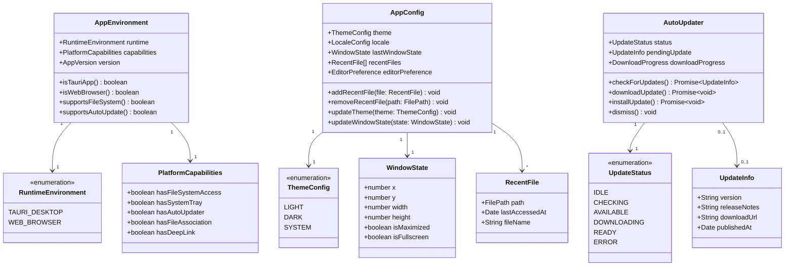

# Platform 도메인 모델
# ModuMark - 플랫폼 Bounded Context

| 항목 | 내용 |
|------|------|
| 문서 버전 | v2.0 |
| 작성일 | 2026-03-07 |
| 수정일 | 2026-03-08 |
| 작성자 | DDD 아키텍트 |
| 상태 | Active (Phase 1 완료) |

---

## 목차

1. [Bounded Context 정의](#1-bounded-context-정의)
2. [Ubiquitous Language](#2-ubiquitous-language)
3. [핵심 Aggregate](#3-핵심-aggregate)
4. [Domain Event 목록](#4-domain-event-목록)
5. [Repository 인터페이스](#5-repository-인터페이스)
6. [Mermaid 클래스 다이어그램](#6-mermaid-클래스-다이어그램)
7. [Context Map](#7-context-map)

---

## 1. Bounded Context 정의

### 컨텍스트 이름: Platform (플랫폼)

**목적**: 운영 환경(Windows 네이티브 앱 / 웹 브라우저)에 대한 추상화를 제공하며, 파일 시스템 I/O, 앱 설정, 창 관리, 배포·업데이트 등 플랫폼 고유 기능을 담당한다.

**경계 설명**:
- 파일 열기/저장/경로 관리 등 로컬 파일 시스템과의 모든 I/O를 책임진다.
- `.md` 파일 기본 앱 등록(파일 연결)을 관리한다.
- 앱 창 상태(크기, 위치, 전체화면) 및 시스템 트레이를 관리한다.
- 자동 업데이트 기능을 담당한다.
- Editor/PDF 도메인은 파일 I/O를 직접 수행하지 않고 Platform을 통해 위임한다.
- 웹 환경에서는 File System Access API / IndexedDB를 통한 접근을 추상화한다.

**핵심 비즈니스 규칙**:
- 사용자 파일은 로컬 파일 시스템에만 저장되며, 서버로 전송되지 않는다.
- 앱 설정(테마, 언어 등)은 로컬 설정 파일에 저장한다.
- Windows 환경에서 `.md` 파일 더블클릭 시 ModuMark가 자동 실행된다.
- 앱 업데이트는 사용자 동의 없이 자동 설치되지 않는다.

---

## 2. Ubiquitous Language

| 한국어 용어 | 영어 용어 | 설명 |
|------------|----------|------|
| 플랫폼 | Platform | 실행 환경 (Windows 앱 / 웹 브라우저) |
| 파일 선택 다이얼로그 | FileDialog | 사용자가 파일을 선택하는 OS 기본 다이얼로그 |
| 파일 연결 | FileAssociation | .md 파일을 ModuMark로 여는 기본 앱 등록 |
| 최근 파일 | RecentFile | 사용자가 최근에 열었던 파일 목록 |
| 앱 설정 | AppConfig | 앱 전반의 사용자 설정값 |
| 앱 창 | AppWindow | 데스크탑 앱의 창 인스턴스 |
| 창 상태 | WindowState | 창의 크기, 위치, 최대화/최소화 상태 |
| 시스템 트레이 | SystemTray | Windows 작업표시줄 트레이 아이콘 |
| 자동 업데이트 | AutoUpdater | 앱 신규 버전 확인 및 업데이트 기능 |
| 업데이트 알림 | UpdateNotification | 새 버전이 있을 때 사용자에게 알리는 메시지 |
| 딥링크 | DeepLink | 외부에서 앱을 특정 상태로 여는 URL 스킴 |
| 런타임 환경 | RuntimeEnvironment | 현재 실행 중인 플랫폼 타입 (TAURI / WEB) |
| 권한 | Permission | 파일 시스템 접근 등 플랫폼 권한 |

---

## 3. 핵심 Aggregate

### 3.1 AppEnvironment Aggregate (앱 환경)

**Aggregate Root**: `AppEnvironment`

**책임**: 현재 실행 환경 타입과 플랫폼별 기능 가용성을 관리한다.

#### Entity

| 엔티티 | 역할 | 식별자 |
|--------|------|--------|
| `AppEnvironment` | Aggregate Root. 실행 환경 상태 관리 | 싱글톤 |

#### Value Object

| Value Object | 역할 |
|-------------|------|
| `RuntimeEnvironment` | 실행 환경 타입 (TAURI_DESKTOP / WEB_BROWSER) |
| `PlatformCapabilities` | 기능 가용성 플래그 (파일 시스템, 트레이, 업데이트 등) |
| `AppVersion` | 현재 앱 버전 (semver) |

---

### 3.2 AppConfig Aggregate (앱 설정)

**Aggregate Root**: `AppConfig`

**책임**: 사용자 설정(테마, 언어, 창 상태, 최근 파일 등)을 관리하고 영속화한다.

#### Entity

| 엔티티 | 역할 | 식별자 |
|--------|------|--------|
| `AppConfig` | Aggregate Root. 앱 전체 설정 관리 | 싱글톤 |

#### Value Object

| Value Object | 역할 |
|-------------|------|
| `ThemeConfig` | 테마 설정 (LIGHT / DARK / SYSTEM) |
| `LocaleConfig` | 언어 설정 (ko / en) |
| `WindowState` | 창 크기·위치·최대화 상태 |
| `RecentFile` | 최근 파일 항목 (경로, 마지막 접근 시각) |
| `EditorPreference` | 에디터 환경 설정 위임 값 (폰트 크기, 자동 저장 간격) |

#### AppConfig 비즈니스 규칙

1. 최근 파일 목록은 최대 20개를 유지한다.
2. 앱 종료 시 현재 창 상태(크기, 위치)를 자동으로 저장한다.
3. 다음 시작 시 저장된 창 상태로 복원한다.

---

### 3.3 FileSystemAccess Aggregate (파일 시스템 접근)

**Aggregate Root**: `FileSystemAccess`

**책임**: 플랫폼 추상화 레이어. Editor/PDF 도메인 대신 실제 파일 I/O를 수행한다.

#### Value Object

| Value Object | 역할 |
|-------------|------|
| `FilePath` | 파일 시스템 경로 |
| `FileContent` | 파일 내용 (텍스트 / 바이너리) |
| `FileDialogOptions` | 다이얼로그 옵션 (필터, 기본 경로 등) |
| `DirectoryPath` | 디렉토리 경로 |

#### 비즈니스 규칙

1. 파일 읽기/쓰기는 반드시 사용자 동의(파일 다이얼로그 선택)를 거쳐야 한다.
2. 웹 환경에서는 File System Access API 또는 다운로드/업로드 방식으로 폴백한다.
3. 파일 쓰기 전 기존 파일 백업 여부를 설정으로 제어할 수 있다.

---

### 3.4 AutoUpdater Aggregate (자동 업데이트)

**Aggregate Root**: `AutoUpdater`

**책임**: 신규 버전 감지, 다운로드, 설치를 관리한다. (Tauri 환경 전용)

#### Value Object

| Value Object | 역할 |
|-------------|------|
| `UpdateInfo` | 업데이트 정보 (버전, 릴리즈 노트, 다운로드 URL) |
| `UpdateStatus` | 업데이트 상태 (IDLE / CHECKING / AVAILABLE / DOWNLOADING / READY / ERROR) |
| `DownloadProgress` | 업데이트 파일 다운로드 진행률 |

#### 비즈니스 규칙

1. 앱 시작 후 5분 이내에 업데이트 확인을 수행한다.
2. 업데이트 설치는 사용자가 명시적으로 승인해야 한다.
3. 업데이트 실패 시 현재 버전으로 계속 실행한다.

---

## 4. Domain Event 목록

| 이벤트 이름 | 발생 시점 | 포함 데이터 | 구독 컨텍스트 |
|------------|----------|------------|--------------|
| `AppStarted` | 앱이 시작될 때 | `version`, `platform`, `startedAt` | Editor, Monetization |
| `AppClosed` | 앱이 종료될 때 | `closedAt` | - |
| `FileOpenedFromSystem` | OS에서 .md 파일을 열었을 때 | `filePath`, `openedAt` | Editor |
| `FileDialogOpened` | 파일 선택 다이얼로그가 열릴 때 | `dialogType`, `openedAt` | - |
| `FileDialogResolved` | 파일 선택 완료 시 | `selectedPaths`, `resolvedAt` | Editor, PDF |
| `RecentFilesUpdated` | 최근 파일 목록이 변경될 때 | `recentFiles`, `updatedAt` | - |
| `AppConfigChanged` | 앱 설정이 변경될 때 | `changedKeys`, `config`, `changedAt` | Editor |
| `WindowStateChanged` | 창 크기/위치가 변경될 때 | `windowState`, `changedAt` | - |
| `UpdateAvailable` | 새 버전 업데이트가 감지될 때 | `updateInfo`, `detectedAt` | - |
| `UpdateDownloadStarted` | 업데이트 다운로드 시작 시 | `version`, `startedAt` | - |
| `UpdateReady` | 업데이트 설치 준비 완료 시 | `version`, `readyAt` | - |
| `UpdateInstalled` | 업데이트 설치 완료 시 | `newVersion`, `installedAt` | - |

---

## 5. Repository 인터페이스

```typescript
// 앱 설정 저장소 인터페이스
interface AppConfigRepository {
  // 현재 앱 설정 조회
  getConfig(): Promise<AppConfig>

  // 앱 설정 저장
  saveConfig(config: AppConfig): Promise<void>

  // 최근 파일 목록 조회
  getRecentFiles(): Promise<RecentFile[]>

  // 최근 파일 추가 (최대 20개 유지)
  addRecentFile(filePath: FilePath): Promise<void>

  // 최근 파일 목록에서 제거 (파일 삭제 등)
  removeRecentFile(filePath: FilePath): Promise<void>
}

// 파일 시스템 접근 인터페이스 (플랫폼 추상화)
interface FileSystemService {
  // 파일 텍스트 읽기
  readTextFile(filePath: FilePath): Promise<string>

  // 파일 바이너리 읽기
  readBinaryFile(filePath: FilePath): Promise<Uint8Array>

  // 텍스트 파일 쓰기
  writeTextFile(filePath: FilePath, content: string): Promise<void>

  // 바이너리 파일 쓰기
  writeBinaryFile(filePath: FilePath, data: Uint8Array): Promise<void>

  // 파일 존재 여부 확인
  exists(filePath: FilePath): Promise<boolean>

  // 파일 열기 다이얼로그
  openFileDialog(options: FileDialogOptions): Promise<FilePath | null>

  // 파일 저장 다이얼로그
  saveFileDialog(options: FileDialogOptions): Promise<FilePath | null>
}

// 창 관리 서비스 인터페이스 (Tauri 전용)
interface WindowService {
  // 현재 창 상태 조회
  getWindowState(): Promise<WindowState>

  // 창 상태 설정
  setWindowState(state: WindowState): Promise<void>

  // 창 최소화/최대화/닫기
  minimize(): Promise<void>
  maximize(): Promise<void>
  close(): Promise<void>
}

// 자동 업데이트 서비스 인터페이스 (Tauri 전용)
interface AutoUpdaterService {
  // 업데이트 확인
  checkForUpdates(): Promise<UpdateInfo | null>

  // 업데이트 다운로드
  downloadUpdate(): Promise<void>

  // 업데이트 설치 (앱 재시작)
  installUpdate(): Promise<void>
}
```

---

## 6. Mermaid 클래스 다이어그램



---

## 7. Context Map

### 다른 Bounded Context와의 관계

```
[Platform BC]
    │
    ├──── Editor BC (Partnership)
    │       관계: 대등한 파트너십
    │       통신: FileOpenedFromSystem 이벤트 발행 → Editor가 문서 로드
    │             Editor의 DocumentSaved 이벤트 수신 → RecentFiles 업데이트
    │       내용: 파일 I/O 서비스 제공, 파일 연결(기본 앱)
    │
    ├──── PDF BC (Customer / Supplier)
    │       관계: Platform이 Supplier (파일 I/O 서비스 제공)
    │       통신: PDF 변환 완료 이벤트 수신 → 파일 저장
    │       내용: PDF 처리 결과 파일의 저장 및 열기 위임
    │
    └──── Monetization BC (Conformist)
            관계: Monetization이 Conformist (Platform 이벤트를 수동적으로 수신)
            통신: AppStarted 이벤트 수신
            내용: 앱 시작 시 광고 초기화 트리거
```

| 관계 방향 | 상대 컨텍스트 | 관계 패턴 | 통신 방식 | 설명 |
|----------|-------------|---------|----------|------|
| Platform ↔ Editor | Editor | Partnership | 도메인 이벤트 (양방향) | 파일 I/O, 최근 파일 |
| Platform → PDF | PDF | Customer/Supplier | 도메인 이벤트 (비동기) | 변환 결과 저장 |
| Platform → Monetization | Monetization | Open Host Service | 도메인 이벤트 (비동기) | 앱 생명주기 알림 |

---

*본 문서는 ModuMark Platform Bounded Context의 도메인 모델을 정의합니다. Tauri/Next.js 기술 구현 상세는 PRD를 참조하세요.*

---

## 문서 이력

| 버전 | 날짜 | 변경 내용 | 작성자 |
|------|------|----------|--------|
| v1.0 | 2026-03-07 | 초안 작성 | DDD 아키텍트 |
| v2.0 | 2026-03-08 | Phase 1 완료 반영: 수정일 추가, 상태 Active로 변경 | 프로젝트 오너 |
